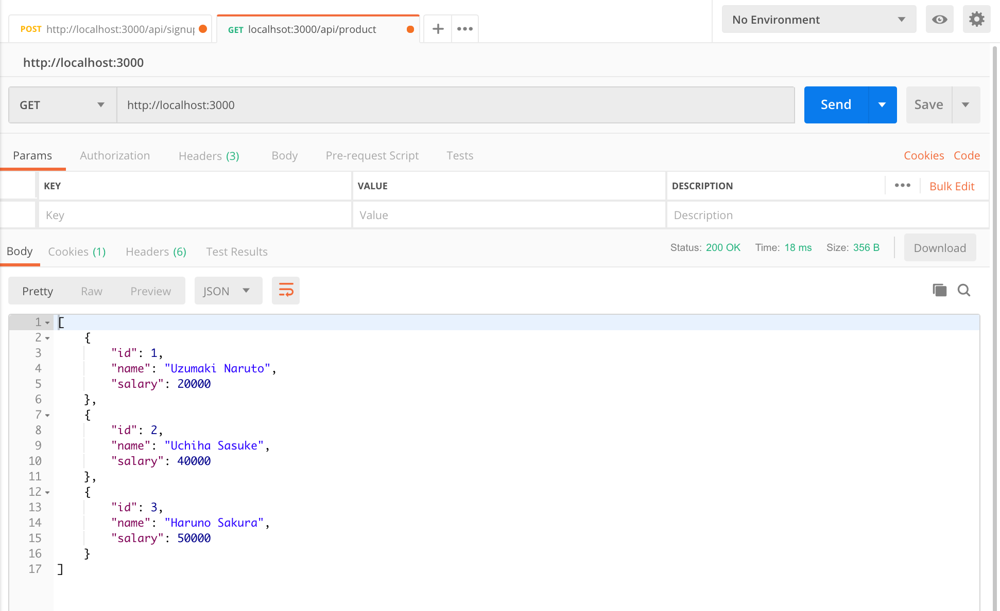
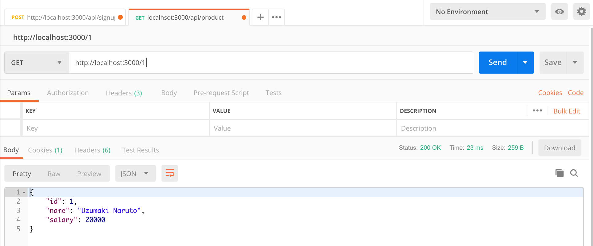
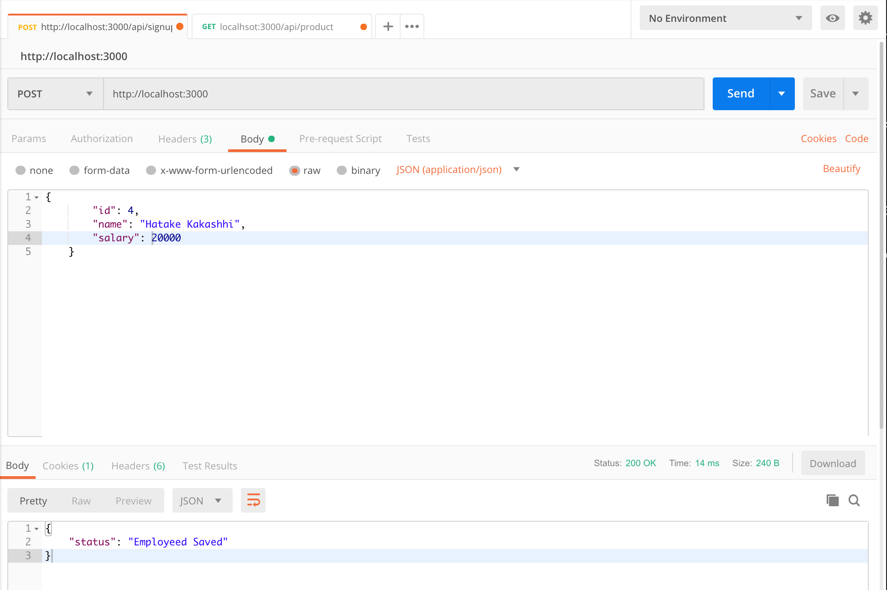

# nodejs-mysql-rest-api

Run this project by this command :

1. `npm install`
2. `nodemon index.js`
3. `localhost:3000`
4. Open Postman

GET all Employees :

GET an Employee by Id :

 

INSERT an Employee

UPDATE an Employee

DELETE An Employee

